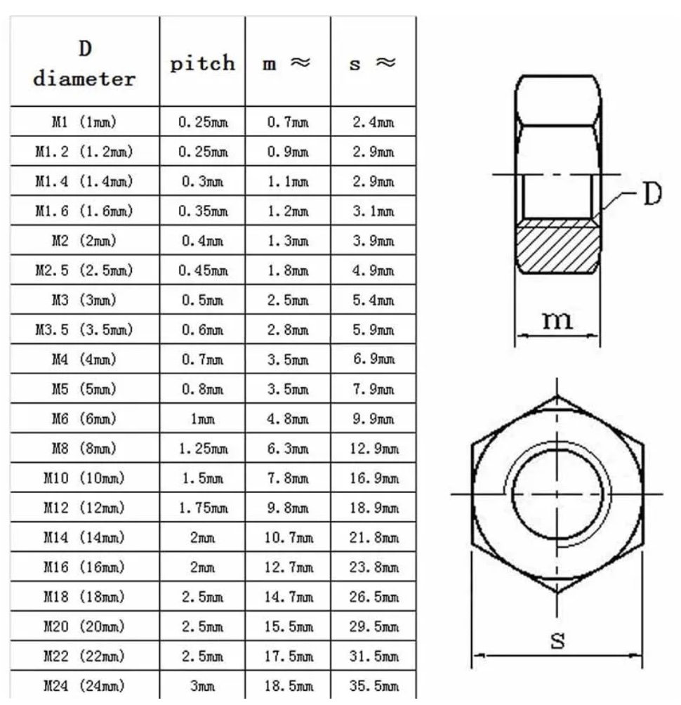
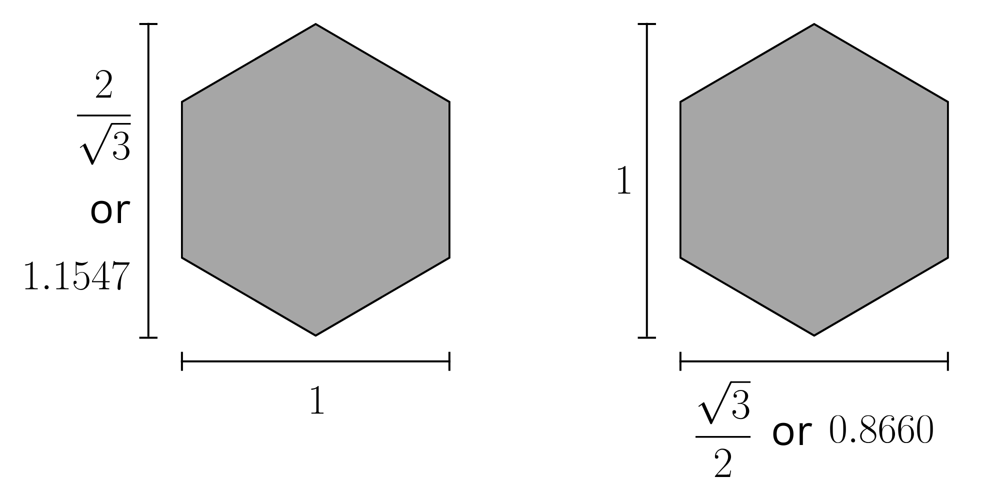
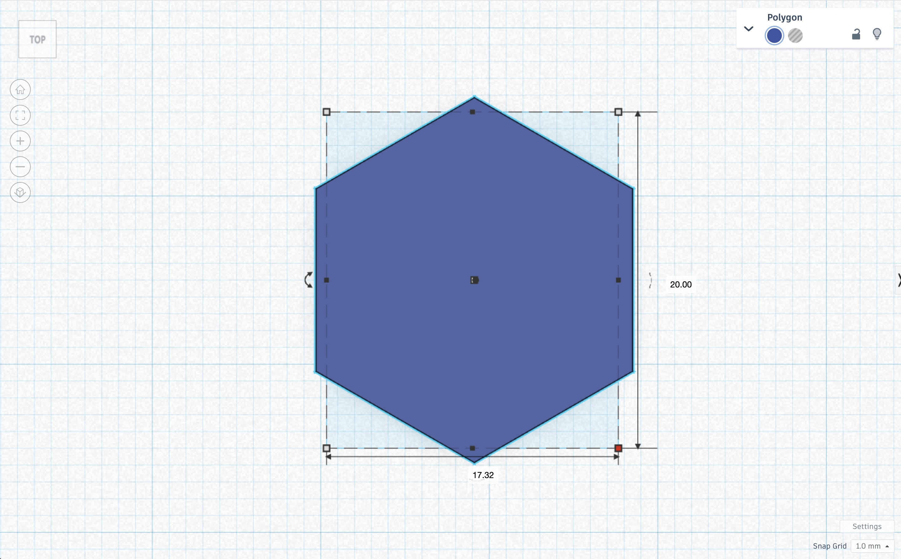
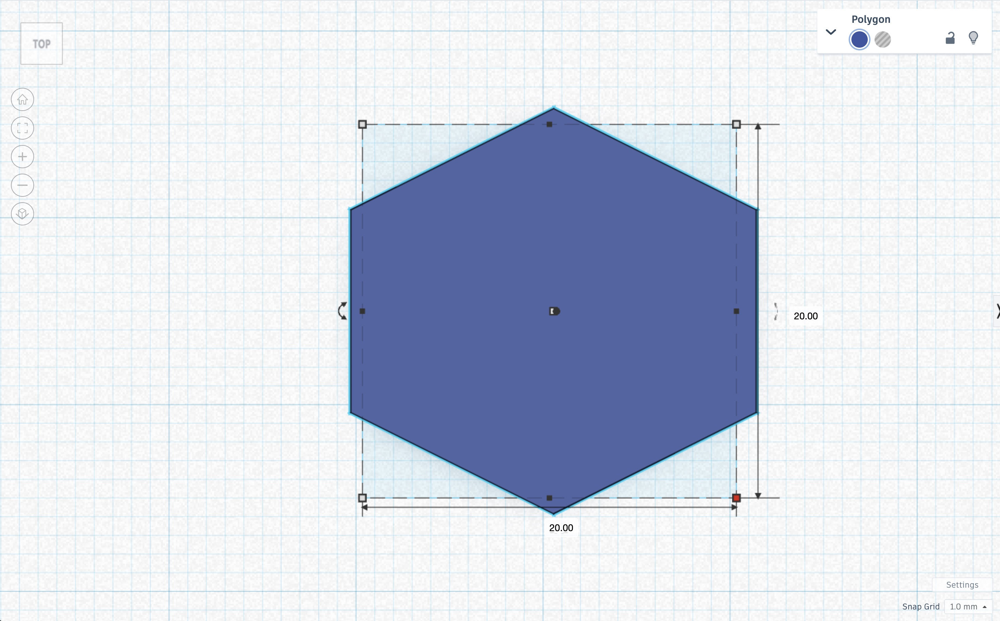
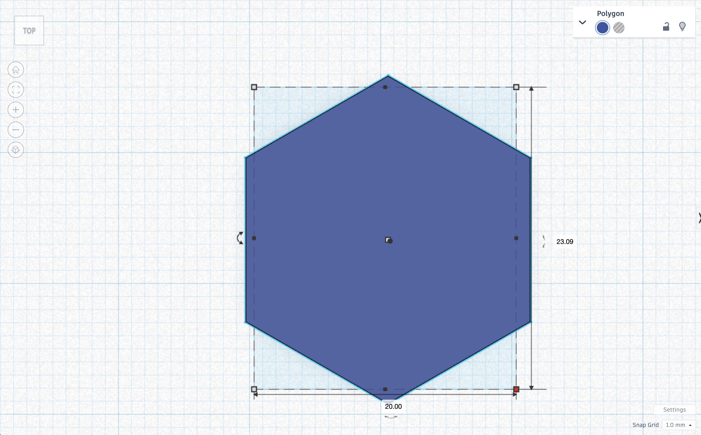
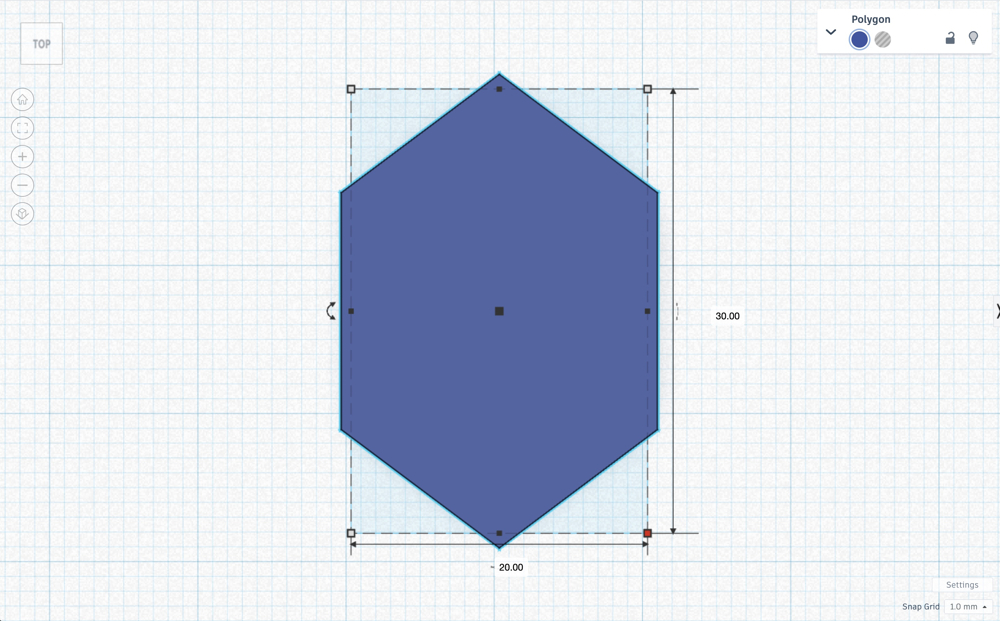
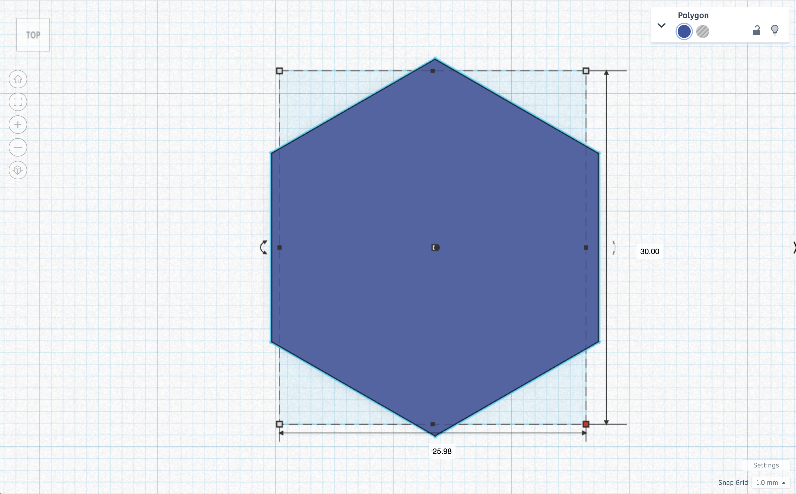

# Differentiation
**For Visual Learners**: Use visual aids such as diagrams and videos to explain the process of designing and testing the pieces. Encourage these students to use color coding in their engineering design notebooks.

**For Auditory Learners**: Explain the steps verbally and encourage discussion. Allow these students to discuss their ideas and processes with a partner or the class.

**For Kinesthetic Learners**: Provide these students with extra materials to manipulate while they are designing their test pieces physically. Encourage them to build prototypes with modeling clay before finalizing their design.

**For Advanced Learners**: Challenge these students to test more than the minimum number of diameters. Encourage them to explore different types of bolts or designs for the test pieces. These students can also explore designing recessed holes or holes for different bolts, such as flathead countersunk bolts.

**For Learners Needing Extra Suppor**t: Provide these students with templates or guides for their design notebooks. Consider pairing them with a partner for support during the design and testing process.

**For English Language Learner**s: Provide vocabulary lists and ensure instructions are clear and understandable. Consider pairing them with bilingual students who can help explain the tasks.

---
**Possible Follow-Up Lessons and Extensions**: 

:::{note}
Tinkercad does not scale objects uniformly. Students will have to calculate the ratio. 
::: 

The image below demonstrates the height to width ratio of a regular hexagon:

The hexagon on the left has a $\frac{2}{\sqrt{3}}:1$ or $1.1547:1$ ratio. The hexagon on the right has a $1:\frac{\sqrt{3}}{2}$ or $1:0.8660$ ratio. Below is a hexagon in Tinkercad with the default values.

If the width was changed from $17.32$ to $20$ it is no longer a regular hexagon.

To make the irregular hexagon above to a regular hexagon, the height would be the width $20\frac{2}{\sqrt{3}}\approx20\cdot1.1547\approx23.094$. Tinkercad only has decimals to the hundredth. Changing the height to 23.09 makes the hexagon closer to a regular hexagon.

Similarly, the height of the hexagon below was changed to $30$.

The width would be $30\frac{\sqrt{3}}{2}\approx30\cdot0.866\approx25.98$.

