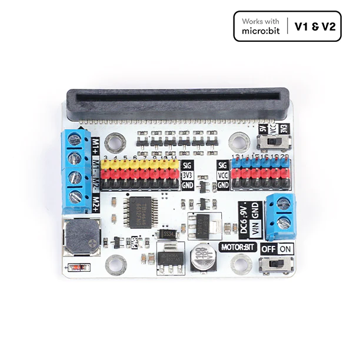

# micro:bit Rover Lessons

```{note}
This is a long-term project and content will be added or possibly removed. If you have any suggestions, corrections or anything else, feel free to contact me at: [simon@hasanprep.org](mailto:simon@hasanprep.org). 
```

This series of lessons will help students design and build a rover using the BBC micro:bit similar to the rover displayed below:


```{attention}
All  measurements in these lessons have been redacted. Students are meant to find values for the bolts independently. Teachers can request dimensions at: [simon@hasanprep.org](mailto:simon@hasanprep.org). 
```

The rover made in these lessons will use the [ELECFREAKS Motor:bit](https://shop.elecfreaks.com/products/elecfreaks-micro-bit-motor-bit?_pos=1&_psq=motor%3Abit&_ss=e&_v=1.0). 



Motor:bit is a micro:bit motor driver breakout board that works with both micro:bit V1 and V2. It supports both Microsoft MakeCode and a MicroPython module explicitly rewritten for these lessons (Removing the docstrings in Chinese). 

This page will be updated to include other robotics boards for micro:bit in the near future.

:::{note} 
These lessons will include the following empty starter code files: 

- A MakeCode with the extension preloaded
- A MicroPython file with the module preloaded.

:::

This book will be updated with lessons for adding sensors to the robot for:

- Line tracking
- Obstacle avoidance 
- Crash detection
- And more ...

These lessons are appropriate for students in computer courses and engineering courses. Computer science students can learn about the engineering design process, and engineering students can use these lessons to learn about coding with either MakeCode or MicroPython.

```{tableofcontents}
```
