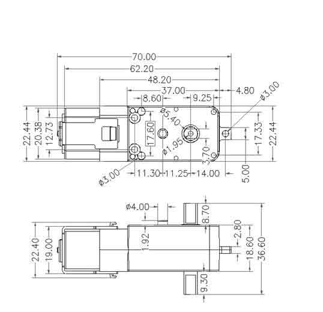
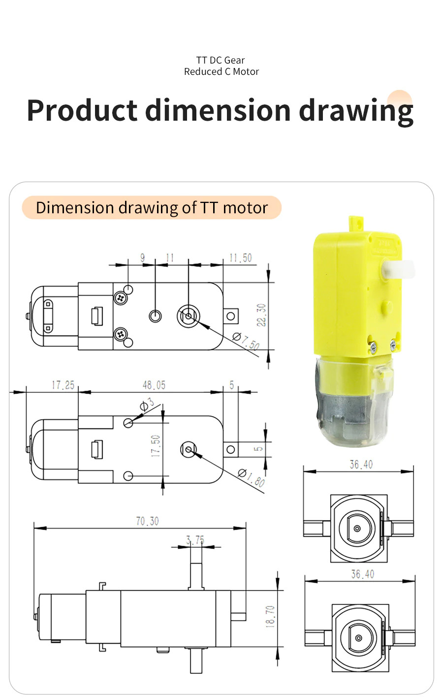
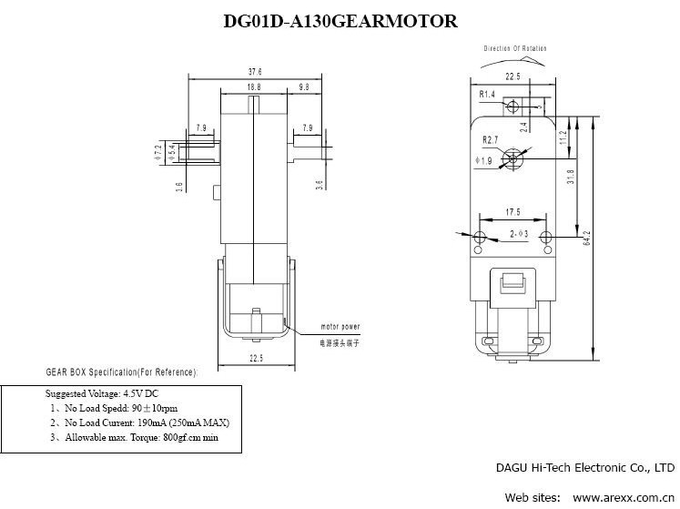
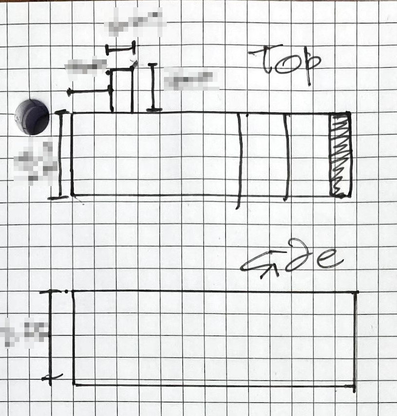
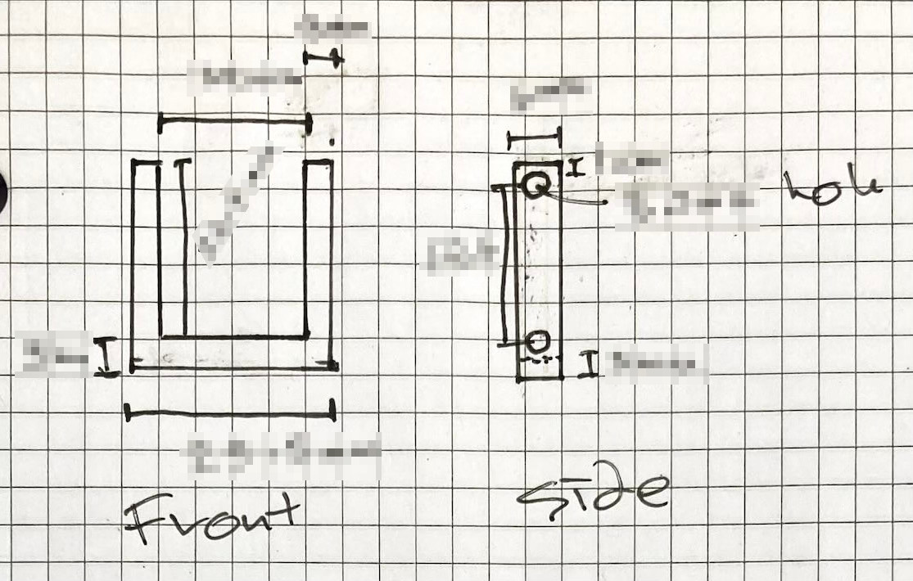
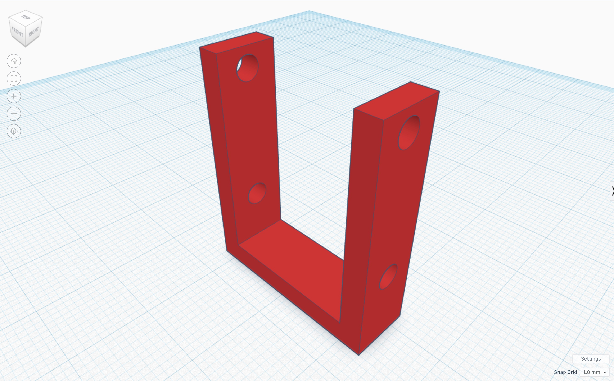

# Lesson

```{contents}
:local:
```

## Opener

Show students a TT motor and ask them to sketch it in their engineering design notebook, labeling as many parts as they can. This will help them become familiar with the motor’s structure and prepare them to design a bracket for it.

---

## Procedure

### **Objective 1: Analyze and Evaluate**

- Distribute the TT motors, TT motor wheels, measuring tools, M3 bolts, and datasheets for the TT motors to the students.







- Ask them to sketch it in their engineering design notebook, labeling as many parts as possible. This will help them become familiar with the motor’s structure and prepare them to design a bracket for it.



- Encourage students to use the calipers and ruler to measure the motor and compare it with the datasheets.


- Ask students to write their observations in their engineering design notebook.

---

### **Objective 2: Design and Create**

- Instruct students to sketch a diagram of the motor bracket in their engineering design notebook. Remind them to label all the dimensions and include more than one angle.



- Check the students' designs. When comfortable with a design, they can render it in Tinkercad. **Remind them that the design in their engineering design notebook should have the exact specifications of the design they created in Tinkercad.** Have them export the STL file for printing when the design is complete. 



- Students 3D print their designs. Make sure students follow all the safety procedures established for using the 3D printer. Oversee the 3D printing of the motor brackets. 


- If a print job fails, encourage students to troubleshoot and revise their design. Ask the students to inspect the bracket and record their successes, observations, or results in their engineering design notebook.


---

### **Objective 3: Apply and Test**

- Ask students to test the fit of the TT motor and M3 bolts in the bracket and record their observations in their engineering design notebooks.


- If a design needs to be revised, instruct students to do so in their engineering design notebook and repeat the process, documenting any changes.

---

### **Objective 4: Reflect and Revise**

- After students create a motor bracket that fits well with the TT motor and M3 bolts, ask them to reflect on the process in their engineering design notebook.
- **Instruct students to keep the datasheets in their engineering design notebook for future reference.** They can be used for reference in the subsequent lessons.
