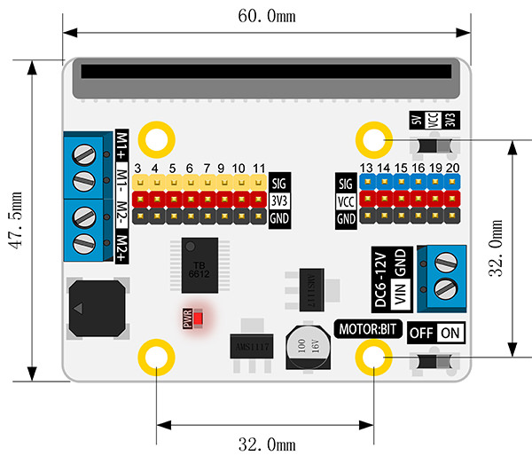
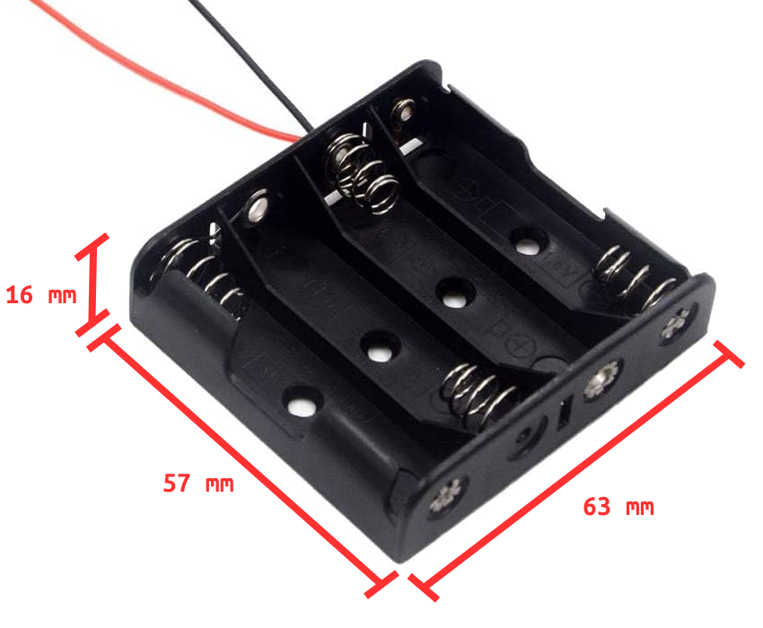
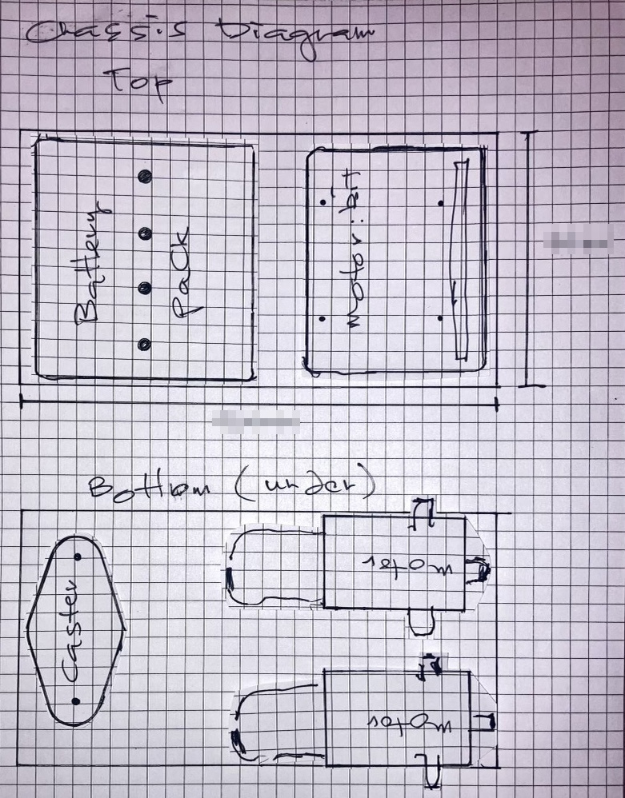
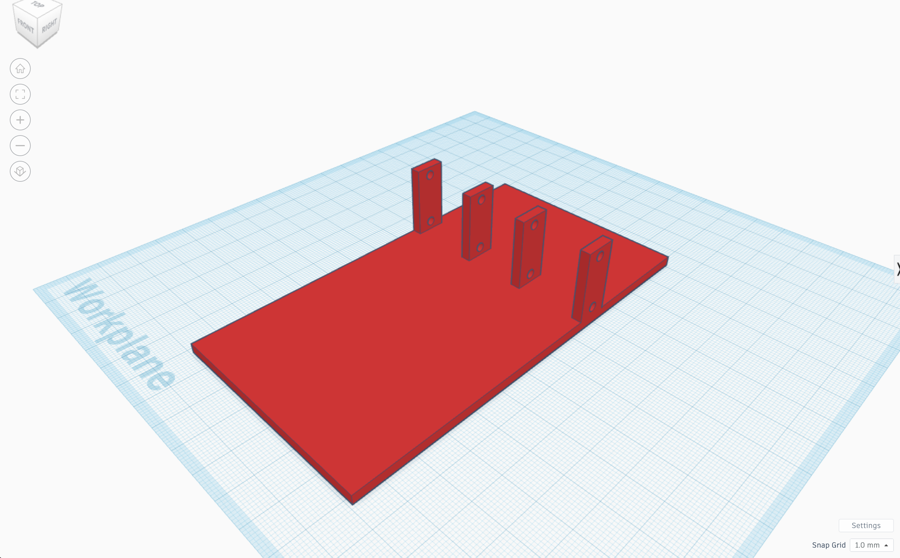

# Lesson

## Opener

### **Objective 1: Analyze and Evaluate**

- Distribute the TT motors, TT motor wheels, measuring tools, M3 bolts, ball caster wheels, Motor:bit boards, battery packs, scissors, and paper. If no datasheets are available, students can record measurments in the next step.

- Encourage students to use the calipers and ruler to measure the TT motor, the Motor:bit, the ball caster wheel, and the battery pack, and compare it with the datasheets. Instruct the student to record the measurements in their engineering design book if no datasheet is available for the component.
- Ask students to write their observations in their engineering design notebook.

## Procedure

### **Objective 2: Component Layout**

- Instruct students to draw an outline of the Motor:bit, ball wheel caster, battery pack, and the motor in the motor bracket (twice) on a sheet of paper.

- Ask the students to cut out the outlined components. This will allow them to move the components around to imagine their chassis.

- Guide students to arrange these cutouts on another sheet of paper to simulate the best fit or placement on the chassis. This will help them determine the best layout for the components on the chassis. Encourage the students to try different layouts for their prototypes.

### **Objective 3: Design and Create**

- Based on their component layout, instruct students to sketch a diagram of the chassis in their engineering design notebook. Remind them to label all the dimensions and include more than one angle.

- Guide students to create a 3D model of the chassis in Tinkercad. Ensure that the model matches the specifications of the diagram in their notebook.

- Oversee the 3D printing of the chassis. If a print job fails, encourage students to troubleshoot and revise their design.

- If a print job fails, encourage students to troubleshoot and revise their design. Ask the students to inspect the chassis and record their successes, observations, or results in their engineering design notebook.

### **Objective 4: Test and Refine**

- Ask students to test the fit of the actual components on the chassis and record their observations in their notebook.

- If a design needs to be revised, instruct students to do so in their notebook and repeat the process, documenting any changes.

### **Objective 5: Reflect and Apply**

- After students create a chassis that fits well with the TT motor, the Motor:bit, the ball caster wheel, and the battery pack, ask them to reflect on the process in their notebook.
