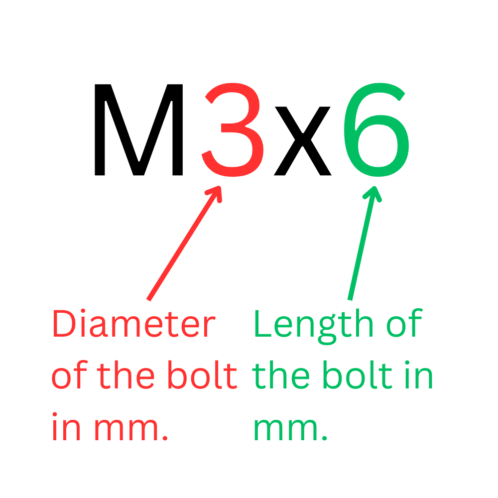

# Notes for Teacher

## Overview

In this lesson, examples will be given for an M3 button head bolt with a hex socket as displayed below:


```{attention}
All measurements in the example given in the lesson will not have any numeric values. Students are meant to find values for the bolts independently.
```

## General Notes

1. **Preparation**: Ensure all materials, especially the datasheets for M3 bolts, 3D printer, filament, and Tinkercad software, are available and ready for use. Check the 3D printer for any maintenance needs. 
2. **Introduction**: Explain the importance of precision in engineering and how this assignment will help students understand this concept. Discuss the specifications of M3 bolts and how to read the datasheets. 
3. **Guidance**: During the design process, guide the students in considering the bolt specifications in their designs. Encourage them to consider why specific hole diameters might work better than others. 
4. **Safety**: Ensure all students follow safety guidelines while using the 3D printer. It might be beneficial to do a safety refresher before starting the assignment. 
5. **Assessment**: Use the provided rubric to assess each student's work. Remember to give constructive feedback to help them improve. 
6. **Differentiation**: Be prepared to support students struggling with the assignment. This could include providing templates, one-on-one assistance, or additional resources. 
7. **Reflection**: After the assignment, have a class discussion about the results. Which hole diameters worked best? Why? What would they do differently next time? 

---

## Understanding Metric Labeling





:::{note} 
M3 bolts have been chosen for this design project because they fit most of the mounting holes found on electronic components. Occasionally, an M2.5 bolt may be needed. Check any datasheets or diagrams of the components to see if an M2.5 bolt is required.
:::

## Types of M3 Nuts

There are a variety of heads for M3 nuts available. The shape of the head TODO.


## Sourcing Materials

### M3 Bolts

M3 bolt sets are available on Amazon. These bolts are more expensive and may contain sizes that are not necessary for the project. The bolts on Amazon do not have a diagram or datasheet. Sourcing bolts from Aliexpress is more affordable. You can buy the sizes needed, and the vendors often include the specifications of the bolts in the images that can be screen-captured for distribution. The only drawback to Aliexpress is that it takes longer to deliver the items.

### 3D Printers

This project works best with a newer generation high-speed 3D printer. The test pieces can print in 4 to 8 minutes, depending on the object's size. These printers are becoming less expensive and more prevalent on the market today.

Here are some high-speed 3D printers:

[AnkerMake M5C](https://www.ankermake.com/collections/all-3d-printers?ref=homepage_AccessoriesBanner1&pf_t_printer_model=M5C+3D+Printers)

[AnkerMake M5](https://www.ankermake.com/collections/all-3d-printers?ref=homepage_AccessoriesBanner1&pf_t_printer_model=M5+3D+Printers)

[Anycubic Kobra 2 Pro](https://www.anycubic.com/products/kobra-2-pro)

[Bambu Lab A1 Series](https://us.store.bambulab.com/collections/a1-series)

[Bambu Lab P1 Series](https://us.store.bambulab.com/collections/p1-series)

[Bambu Lab X1 Series](https://us.store.bambulab.com/collections/x1-series)

### Filament

Filament can be expensive. Luckily, there is a brand that offers inexpensive filament and discounts when purchasing 3 or more spools:

[Voxel](https://voxelpla.com/)
