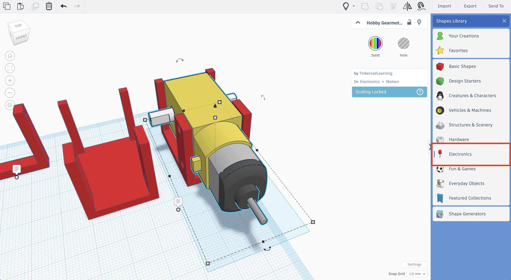
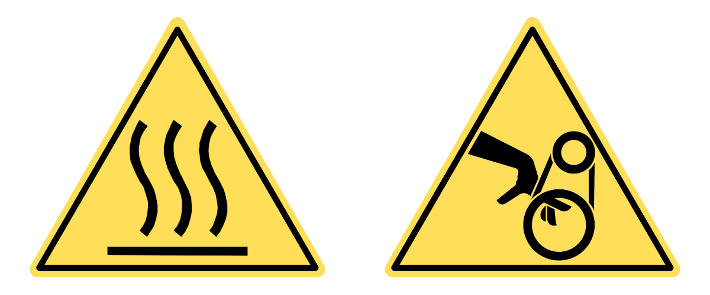
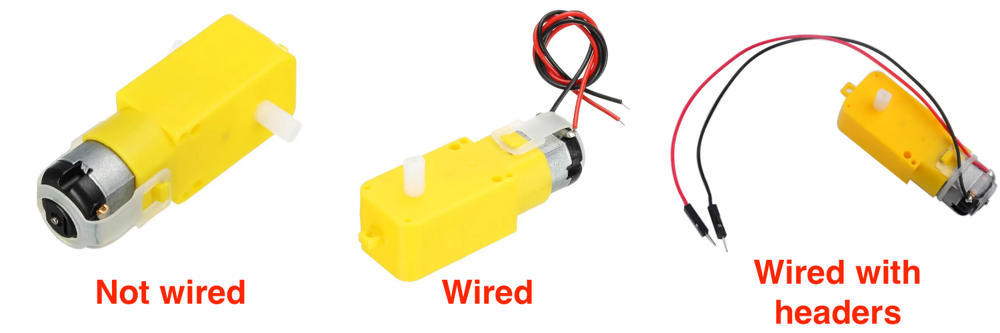
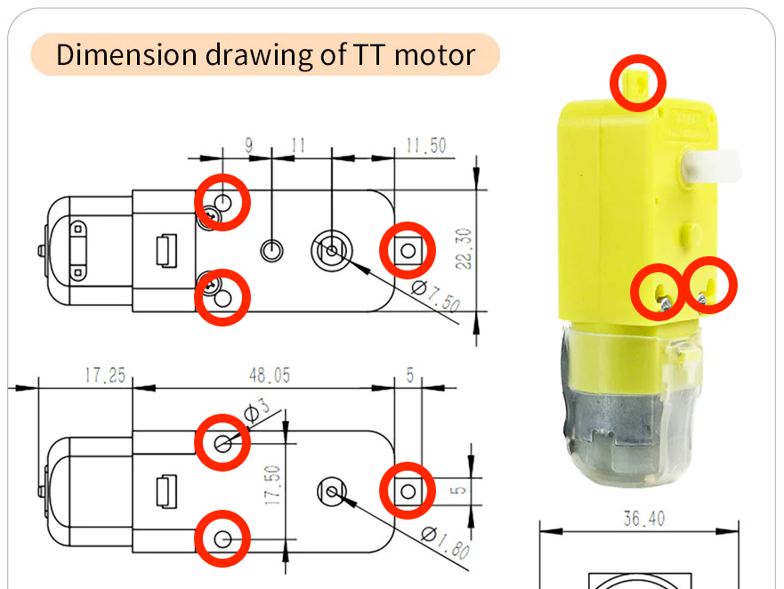
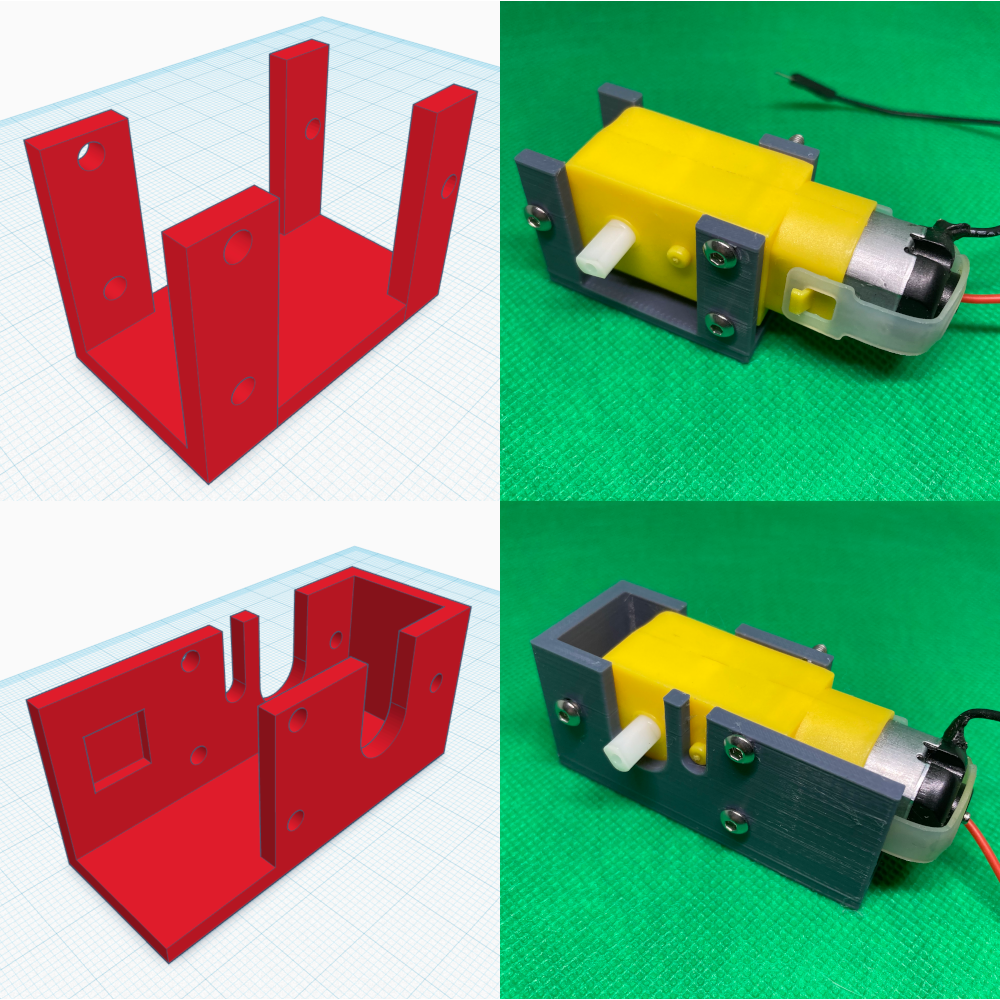

# Notes for Teacher

***In Progress***

```{contents}
:local:
```

## Overview

In this lesson, students will design a bracket to mount a TT motor with 2 M3x30 bolts. This bracket will be integrated into the chassis in the next lesson.

```{attention}
All measurements in the examples have been redacted. Students are meant to find values for the bolts independently. Teachers can request dimensions at [simon@hasanprep.org](mailto:simon@hasanprep.org). 
```

## General Notes

### Preparation

Ensure all materials, especially the datasheets for the components, 3D printer, filament, and Tinkercad software, are available and ready for use. Check the 3D printer for any maintenance needs. 

### Introduction

Explain the importance of planning where components are placed, which can affect the design of the chassis. Some of the rovers will topple during testing. Careful consideration of the weight distribution of the components will be an essential aspect of the design process. The walls of the test bracket should be 3mm. A bracket will be functional if it only secures the two holes near the center of the motor. If students intend to enclose the entire motor, they must account for protrusions in the design. These dimensions of the protrusions are on one datasheet.

### Guidance

During the design process, guide the students in considering the measurements on the datasheet and the measurements they recorded. Mention that the bracket should not be too tight, as it will constrict the gears inside the motor. The bracket should not be too loose, as it will cause the motor to move around. The motor should slide in and out of the bracket easily. 

```{tip}
Discourage students from erasing anything in their engineering design notebooks. Ensure them that there will be no point reductions for "mistakes" as they are part of the process. It is also good for them to indicate the version of the item that they are designing. In Tinkercad, it is also helpful to modify a copy and not the previous iteration of the item. Creating a system where the version number in the engineering design notebook and the version of the model is consistent will help the student when the time comes to reflect on the design process.
```

```{tip}
There is a TT motor 3D in Tinkercad available in the Shapes Library under Electronics. This 3D model can be a good tool to determine if the students are on the right track with their motor bracket 3D designs (i.e. too wide, too tight), but model may not be to scale. ***Students should not rely on the dimensional accuracy of the 3D model of the motor in Tinkercad when designig their brackest***


```

### Safety

```{warning}
**Burn Hazard and Pinch Hazard**

Fused filament fabrication 3D printing involves high temperatures above 180° C, and moving parts.
```

Ensure all students follow all established safety guidelines while using the 3D printer.  It might be beneficial to do a safety refresher before starting the assignment. 

```{tip}
Developing a badge system where students earn badges for undergoing safety training and pass a safety test is helpful. Equipment safety tests are available on [ITEEA's Safety Resources](https://www.iteea-safety.org/index.htm) page. 
```

### Assessment

Use the provided [rubric](../assessment/assessment-02.md) to assess each student's work. Remember to give constructive feedback to help them improve. 

### Differentiation

Be prepared to support students struggling with the assignment. This could include providing templates, one-on-one assistance, or additional resources. For more information, visit the [Differentiation](../differentiation/differentiation-02.md) section of this lesson.

### Reflection

After the assignment, have a class discussion about the results. Which hole diameters worked best? Why? What would they do differently next time? 

## Sourcing Materials

TT motors are available with or without wheels on Amazon and eBay. They often do not have some specifications, such as the supply voltage range or gear ratio. Many gear motors often do not come with wires and may require soldering. Others may come with wires without an adequate terminal block connector.

The most accessible motors to use have Dupont connectors. Wires with Dupont connectors are available in most electronics starter kits,  like the ones displayed below:


Motors are available with or without wires. Here are some of the possible ways TT motors can be sources:



| Motor Type             | Advantages                                                   | Disadvantages                                                |
| ---------------------- | ------------------------------------------------------------ | ------------------------------------------------------------ |
| **Not wired**          | Students can learn about soldering.<br />Students can learn to crimp Dupont headers to wires.<br />Students can determine the length of the wire according to their design.<br />These motors are the least expensive.<br / | These motors often do not come with datasheets specifying voltage.<br />These motors require soldering.<br />These motors do not come with headers. |
| **Wired**              | Students do not have to solder.                              | Bare wires without headers often make poor contact with the terminals on the motor driver boards.<br />The length of the wire is a fixed length. |
| **Wired with headers** | Students do not have to solder.<br />Students do not have to crimp Dupont headers to wires. | Dupont connectors often need to be changed.<br />The length of the wire is a fixed length.<br />These motors are the most expensive. |

Ultimately, the type of TT motor purchased depends on the teacher's preference and student experience. If students have complete control over the decisions in the design process and soldering and crimping wires are an option, the motors without wires can be the best fit for the project. If students have limited time to complete the project or the teacher is not comfortable with students learning how to solder and crimp wires, the motors with Dupont headers may be the best option. 

## Follow-Up Lessons or Extensions

### Designing the Brackets to Accommodate the Third Mounting Hole

The lesson only instructs students to mount the motor using a bracket fixed to the holes near the center of the motor. An optimal motor bracket will fix the motor to all three fastening holes on the motor displayed below:



These brackets are more complex and require a more detailed review of the datasheets. Students also have to consider any protrusions in the design process. Here are examples of motor brackets with the third mounting hole included in the design:



